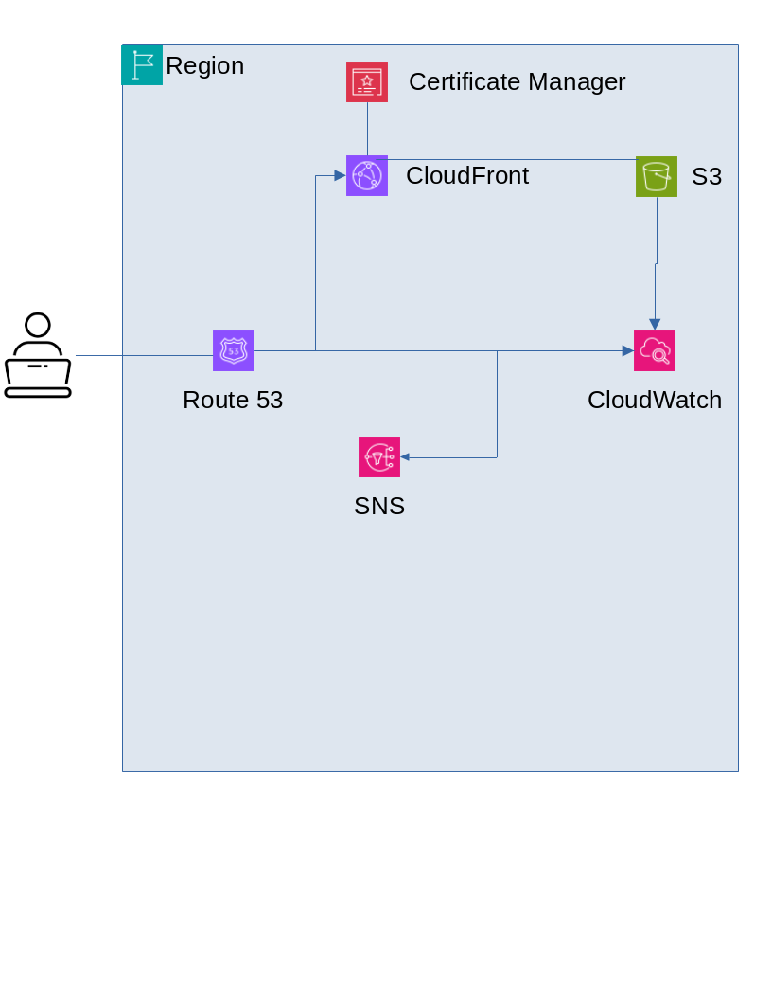

# Portfolio Website

## Overview

In an era of intense competition in local and global markets, boosting personal visibility has become crucial. While platforms like LinkedIn, Facebook, X (formerly Twitter), and Instagram offer exposure, they often lack a professional focus and do not grant users full control over their data. This project aims to address these limitations by providing a custom portfolio website where users can showcase their professional achievements while retaining complete control over their data and online presence.

## Goals

1. Architect a highly secure, durable, and available portfolio website.
2. Deploy the website using AWS services to ensure scalability and reliability.

## Features

### Functional Requirements
- Add, update, and remove personal and professional information (e.g., experience, education, certifications, and projects).
- Support non-text data, such as images and audio files, to enhance the portfolio.
- Accessible globally with some geographic restrictions.
- Compatibility with commonly used web browsers.
- Provide data insights and reports from website activity.
- Monitor service performance effectively.

### Non-Functional Requirements
- High availability and minimal latency.
- Easy maintainability.
- Cost efficiency using a pay-as-you-go model without vendor lock-in.

## Architecture and Design

### AWS Services
The portfolio website leverages AWS services to meet functional and non-functional requirements:

1. **Amazon S3**: 
   - Hosts the static website and stores non-text data like images and audio.
   - Ensures high availability and durability.

2. **Amazon CloudFront**:
   - Manages content distribution through edge locations for reduced latency.
   - Enhances fault tolerance.

3. **Amazon CloudWatch**:
   - Monitors website performance (e.g., CPU, memory, and network utilization).
   - Integrates with SNS to send notifications for performance anomalies.

4. **Amazon Simple Notification Service (SNS)**:
   - Delivers notifications via email, SMS, and other messaging protocols.
   - Aids in timely mitigation of service failures.

5. **Amazon Route 53**:
   - Manages DNS and routing for the portfolio website.
   - Ensures high availability and global coverage.

6. **AWS Certificate Manager**:
   - Provides SSL/TLS certificates for the website.
   - Ensures secure communication, especially for .dev domains.

### Architectural Diagram

## Deployment

The portfolio website is deployed on AWS using a combination of serverless and managed services to ensure scalability and cost-effectiveness. Static assets are hosted on Amazon S3, with global distribution managed by CloudFront. DNS and SSL/TLS management are handled by Route 53 and Certificate Manager, respectively.

## Contact

For questions or further information, feel free to reach out to the project maintainer:  
**Gemechu Gesifeta**  
Shaggar, Oromia State, Ethiopia

---

Make sure to upload the architectural diagram image (`portfolio-diagram.png`) to your GitHub repository alongside this README file for it to render properly. Let me know if you'd like any other updates!
